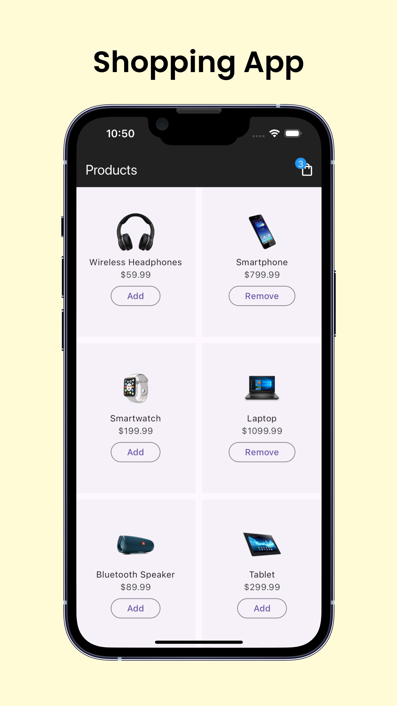
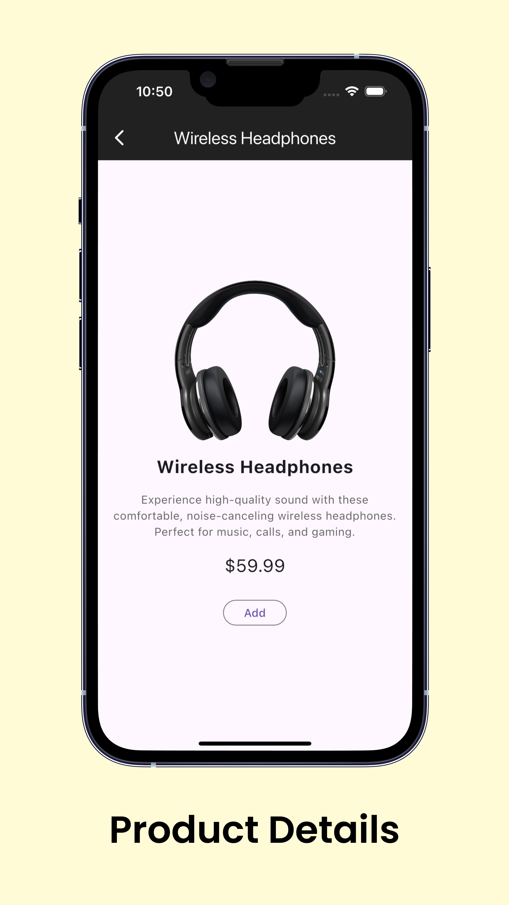
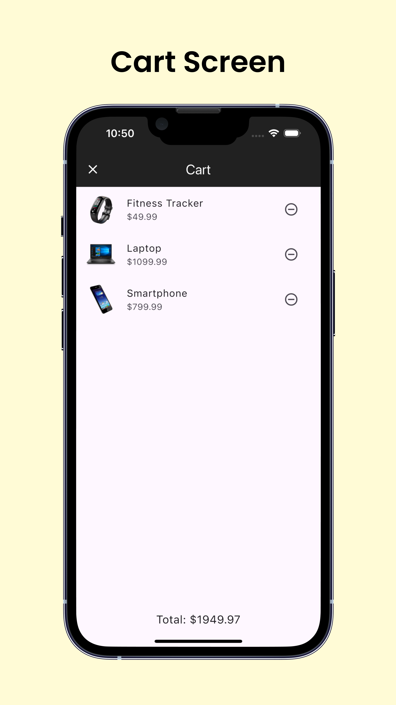
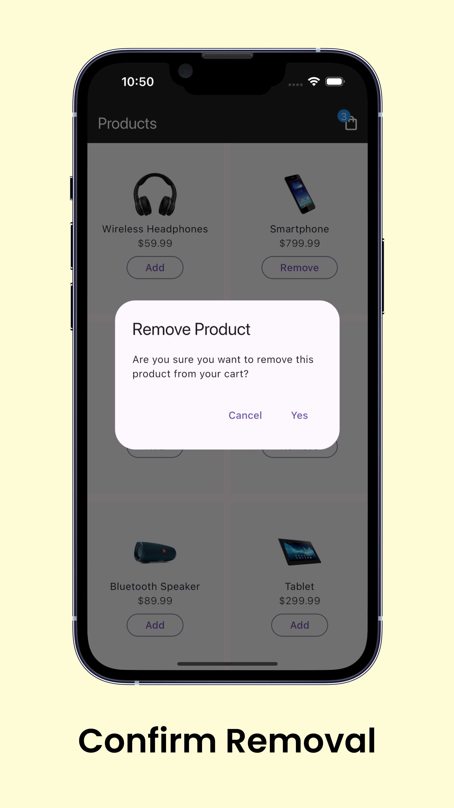

# Flutter Shopping App

A simple and elegant shopping app built with Flutter. This app includes smooth animations, robust state management, and local storage for a seamless shopping experience.

## Features

- **State Management**: Uses `Bloc` (with `Cubit`) for efficient state management.
- **Local Storage**: Stores data locally using the `Hive` database.
- **Hero Animations**: Adds a delightful user experience with `Hero` animations for product images.
- **Navigation**: Simplifies navigation with the `GoRouter` package.
  
## Screenshots







### Packages Used

This project uses the following Flutter packages:

- **[go_router](https://pub.dev/packages/go_router)**: ^14.3.0 – For streamlined navigation and deep linking.
- **[hive](https://pub.dev/packages/hive)**: ^2.2.0 – Lightweight and fast NoSQL database for local storage.
- **[hive_flutter](https://pub.dev/packages/hive_flutter)**: ^1.1.0 – Adapter to easily integrate Hive with Flutter.
- **[flutter_bloc](https://pub.dev/packages/flutter_bloc)**: ^8.1.6 – State management with `Cubit` and `Bloc`.
- **[hive_generator](https://pub.dev/packages/hive_generator)**: ^2.0.1 – Code generator for creating Hive adapters for custom data models.
- **[build_runner](https://pub.dev/packages/build_runner)**: ^2.3.0 – Tool for running code generators, used for `hive_generator`.

To install these packages, simply run:

```bash
flutter pub get


### Prerequisites

Make sure you have Flutter installed. If not, follow the [Flutter installation guide](https://flutter.dev/docs/get-started/install).

### Installation

1. **Clone the repository**:
   ```bash
   git clone https://github.com/otabekinha/shopping_app_bloc.git
   cd flutter-shopping-app
